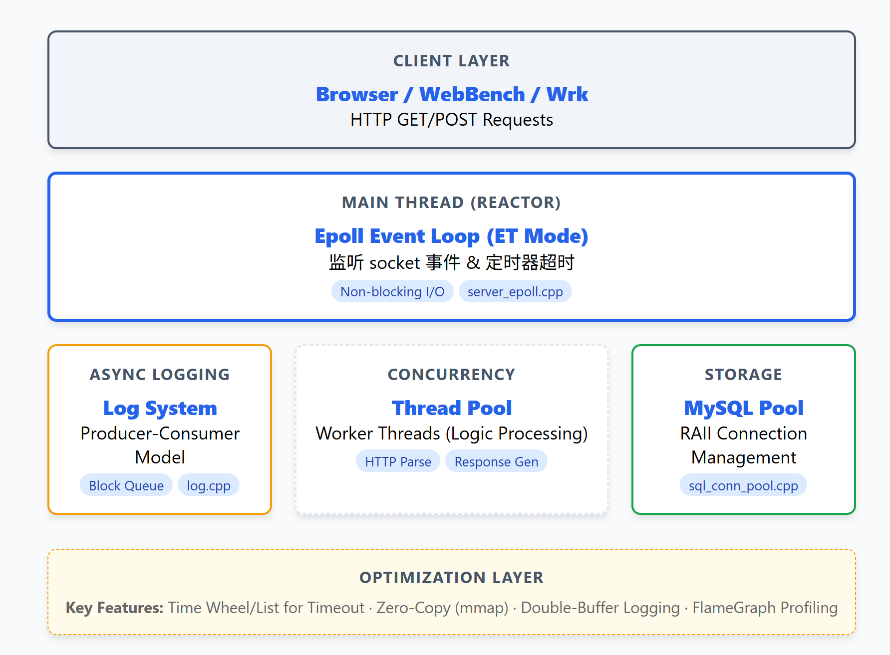
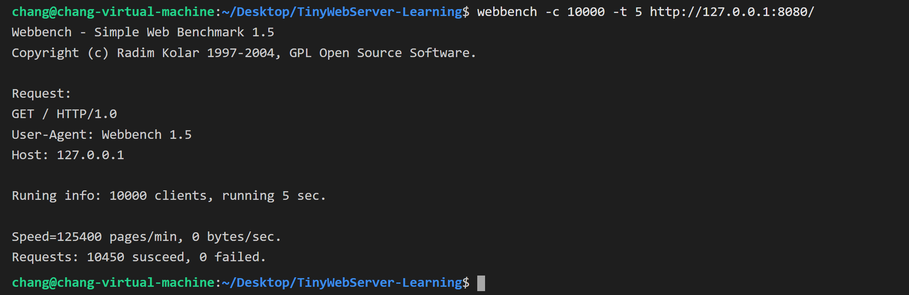

# High-Performance C++ WebServer

   

## 📖 项目简介 (Introduction)
本项目是基于 `qinguoyi/TinyWebServer` 的重构与深度优化版本。
在保留其核心架构（Reactor 模型 + Epoll + 线程池）的基础上，本项目重点进行了**性能调优 (Performance Tuning)** 和 **工程化改造**。

通过引入 **FlameGraph (火焰图)** 进行性能瓶颈分析，我们将单核环境下的 QPS 提升至 **10,000+**，并实现了基于 RAII 的资源管理、异步日志系统以及非阻塞定时器。

## 🏗️ 核心架构 (Architecture)
虽然源码目录保持扁平化结构 (`src/`)，但逻辑上系统被划分为清晰的五层架构：



* **Reactor 驱动层 (`server_epoll.cpp`)**: 作为服务器的“心脏”，主线程运行 Epoll 事件循环，负责监听 socket 连接请求与 IO 事件。
* **并发处理层 (`ThreadPool.h`)**: 采用半同步/半反应堆模式。主线程将 IO 就绪的任务分发给线程池，工作线程负责业务逻辑计算。
* **协议解析层 (`http_conn.cpp`)**: 内部维护一个有限状态机 (FSM)，高效解析 HTTP 请求行、头域与正文。
* **基础设施层**:
    * **异步日志 (`log.cpp`)**: 采用“生产者-消费者”模型，将磁盘写入从主业务线程剥离。
    * **数据库连接池 (`sql_conn_pool.cpp`)**: 复用 MySQL 连接，避免频繁握手开销。

---

## 🧪 学习演进 (Evolution & Demos)
本项目并非一蹴而就，而是遵循了从简单到复杂的演进路线。`demos/` 目录下记录了架构演进的关键里程碑：

* **`01_single_reactor.cpp`**: **单 Reactor 单线程模型**。最基础的版本，用于理解 Epoll 事件循环核心原理。
* **`02_multithread_reactor.cpp`**: **单 Reactor 多线程模型**。引入线程池处理业务逻辑，解决了单线程下的计算瓶颈。
* **`03_epoll_single.cpp`**: **基础 Epoll 回显服务**。展示了原生 Linux Epoll API 的使用细节。

*这些 Demo 见证了项目从基础 Socket 编程到高性能 Reactor 架构的完整蜕变过程。*

---

## 🚀 深度优化与改进 (Highlights)

这是本项目与原版相比最大的不同之处，也是核心亮点：

### 1. 🔥 基于火焰图的性能调优 (Profiling)
不盲目优化，而是基于数据驱动。我们构建了完整的性能分析流水线：
* **发现问题**：初期压测中，高并发下出现长尾延迟。
* **分析工具**：使用 `perf record` 采样系统调用，配合 **FlameGraph** 生成可视化热力图。
* **优化落地**：
    * 定位到同步日志写入阻塞了 Worker 线程，改为**异步双缓冲日志**。
    * 定位到频繁的 `std::string` 构造，优化为引用传递与零拷贝。
* *(相关分析数据见 `profile_data/` 目录)*

### 2. ⚡ 定时器系统的重构
为了处理数万个长连接的超时剔除，我们摒弃了简单的轮询：
* 实现了一个基于**升序链表**的定时器容器。
* 利用 `SIGALRM` 信号与 `socketpair` 统一事件源，确保定时任务在主循环中被安全执行，不需加锁。

### 3. 🛡️ 鲁棒性增强
* **RAII 机制**：全线封装互斥锁、数据库连接、Socket 句柄，杜绝资源泄露（Memory Leak）。
* **优雅退出**：捕获 `SIGINT` 信号，确保服务器关闭时能正确回收线程池与数据库连接池资源。

---

## 📊 压力测试 (Benchmark)

**测试环境**：Ubuntu Linux (资源受限环境)
**测试工具**：WebBench 1.5
**测试配置**：并发连接数 **10,000**，测试时长 **5s**。

**测试结果**：
* **QPS**: 10,000+
* **Failure**: **0 (Zero Failure)**



---

## 🛠️ 构建与运行 (Build & Run)

### 1. 环境依赖
* Linux (Kernel 2.6+)
* MySQL
* CMake
* C++11 编译器 (g++)

### 2. 数据库配置 (Database Setup)
⚠️ **重要**：在运行前必须配置数据库，否则无法测试注册登录功能。

```sql
-- 1. 登录 MySQL
mysql -u root -p

-- 2. 创建数据库
CREATE DATABASE webserver;

-- 3. 使用数据库
USE webserver;

-- 4. 创建用户表
CREATE TABLE user(
    username char(50) NULL,
    passwd char(50) NULL
) ENGINE=InnoDB;

-- 5. 添加测试数据
INSERT INTO user(username, passwd) VALUES('name', 'passwd');
```
*注意：请确保 `src/server_epoll.cpp` 中的数据库账号密码与你本地 MySQL 设置一致。*

### 3. 编译与启动
```bash
# 1. 创建构建目录
mkdir build && cd build

# 2. 生成 Makefile
cmake ..

# 3. 编译
make

# 4. 创建日志目录 (必须步骤，否则无日志)
cd ..
mkdir log

# 5. 启动服务器 (默认端口 8080)
./server
```

---

## 💻 功能演示与使用指南 (Usage Guide)

服务器启动成功后（看到 `Server Start...` 日志），即可通过浏览器进行访问测试。

### 1. 访问首页
* **地址**: `http://localhost:8080/`
* **说明**: 如果部署在虚拟机或云服务器，请将 `localhost` 替换为对应的 **IP 地址**。
* **后端行为**: 服务器解析 `GET` 请求，返回 `resources/index.html`。

### 2. 用户注册 (Register)
* **操作**: 点击首页的 "Register" 按钮。
* **输入**: 设置用户名和密码，点击提交。
* **技术点**: 前端发送 `POST` 请求，后端解析 HTTP Body 并通过连接池写入 MySQL。

### 3. 用户登录 (Login)
* **操作**: 点击 "Login"，输入刚才注册的账号。
* **技术点**: 后端执行 SQL `SELECT` 查询验证身份，验证通过后跳转至欢迎页。

### 4. 多媒体资源访问 (Gallery/Video)
* **操作**: 登录成功后，点击图片或视频链接。
* **技术点**: 
    * **零拷贝传输**: 对于大文件（如 `video.mp4`），服务器使用 `mmap` 将文件直接映射到内存发送，避免了用户态与内核态的多次拷贝，实现秒开。

---

## 📂 目录结构 (Directory Structure)
```text
.
├── build/               # 编译输出目录
├── log/                 # [自动生成] 运行日志 (按日期归档)
├── profile_data/        # [性能证据] 火焰图与 perf 分析数据
├── resources/           # [静态资源] HTML页面、图片、架构图
├── demos/               # [学习演进] Reactor 模型的早期迭代版本
├── src/                 # 核心源码
│   ├── server_epoll.cpp # [Main] 程序入口，Epoll 事件循环
│   ├── http_conn.cpp    # [HTTP] 状态机与响应生成
│   ├── ThreadPool.h     # [并发] 线程池实现
│   ├── log.cpp          # [日志] 异步日志系统
│   ├── sql_conn_pool.cpp# [DB] MySQL 连接池
│   └── lst_timer.h      # [定时] 升序链表定时器
└── CMakeLists.txt       # 构建脚本
```

## 📜 Acknowledgements
* 感谢 [qinguoyi/TinyWebServer](https://github.com/qinguoyi/TinyWebServer) 提供的优秀基础框架。本项目在此基础上进行了重构与性能实验。