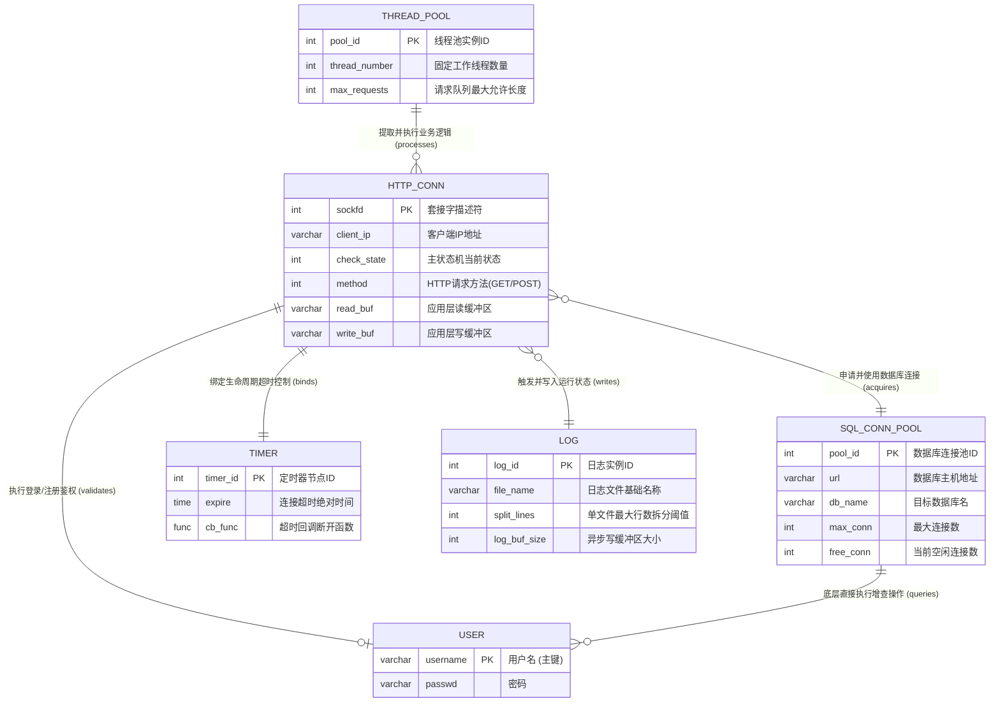
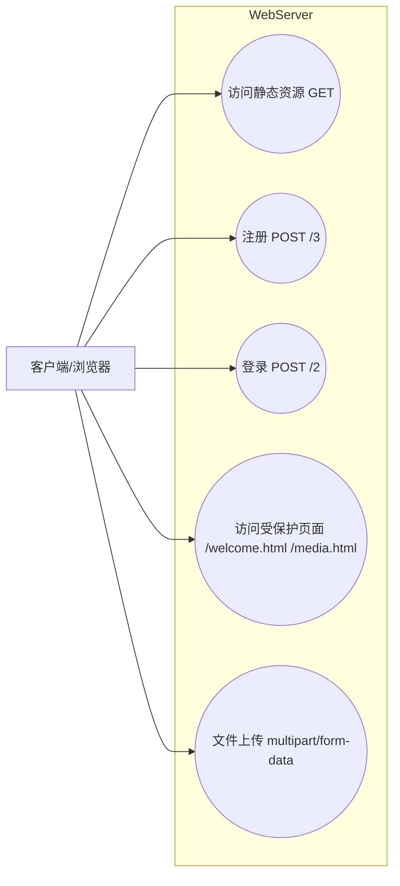
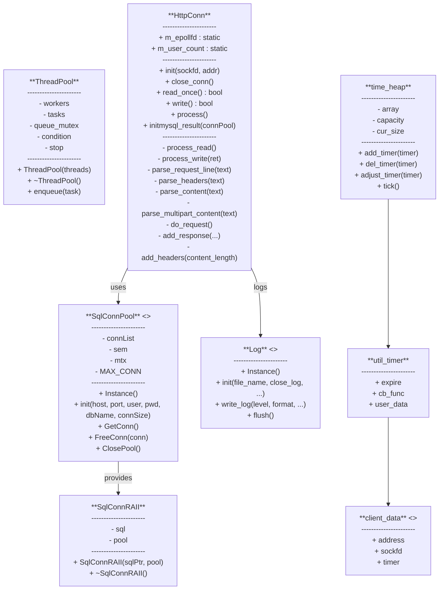
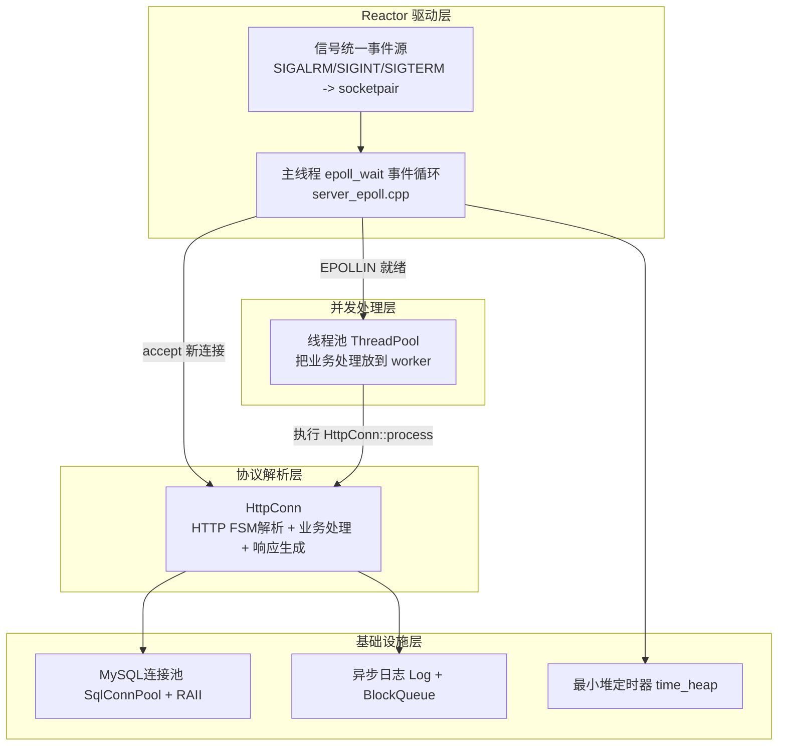
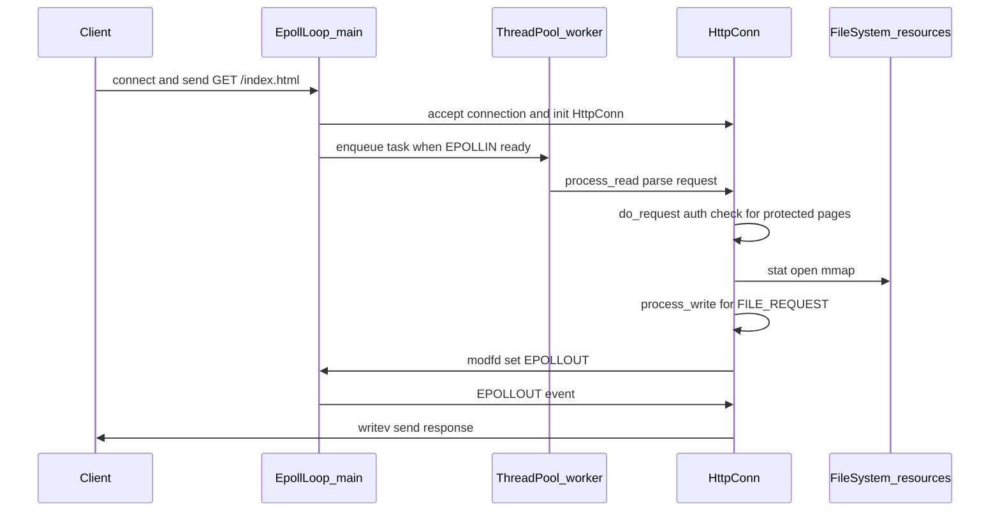
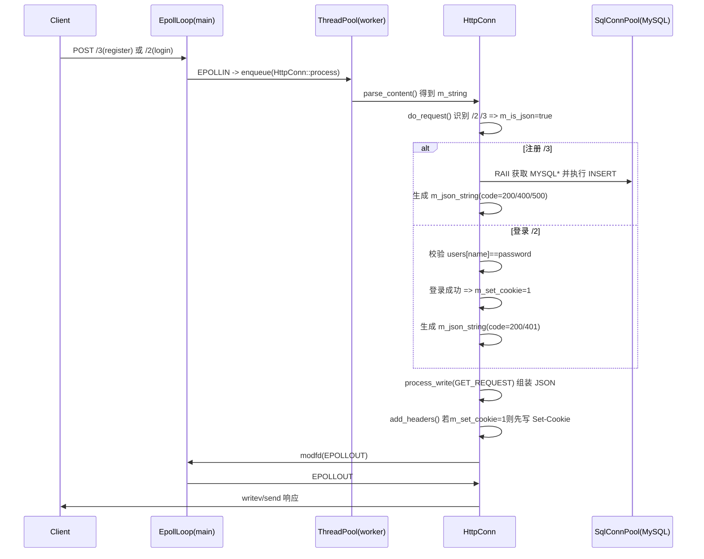
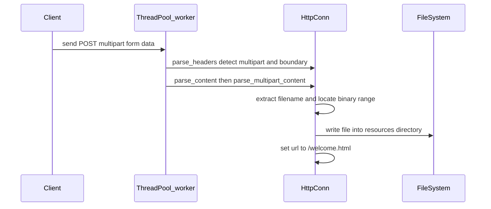
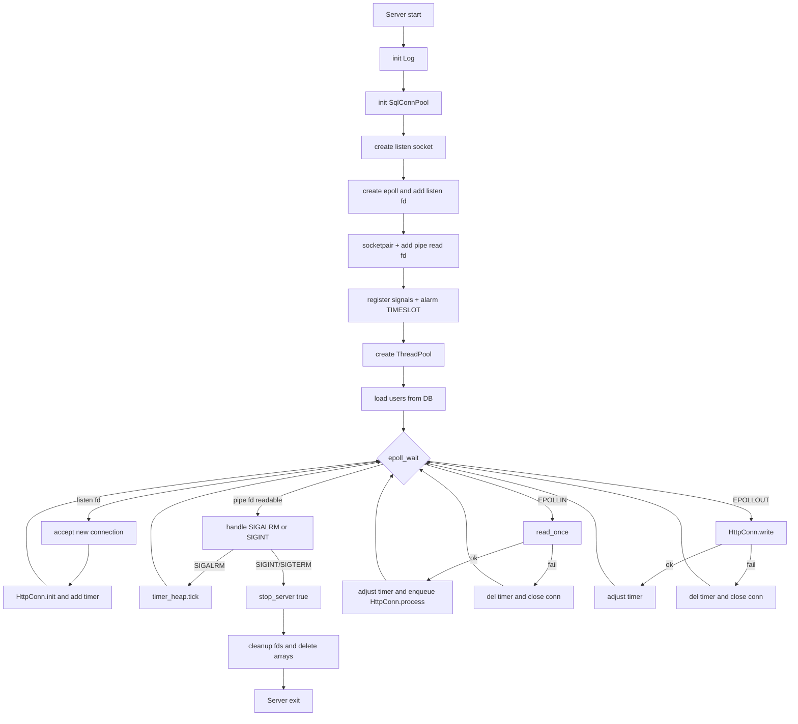

# TinyWebServer-Learning 设计文档

> 仓库：`Paris-cyx/TinyWebServer-Learning`（main 分支）
>
> 本文档**只包含与当前项目代码/README 已实现功能一致**的内容：
> - Reactor(Epoll) + 线程池
> - HTTP 解析与静态资源返回（`resources/`）
> - MySQL 用户注册/登录（`user` 表）
> - Cookie 登录态（`is_login=true`）
> - multipart/form-data 文件上传（保存到 `resources/upload_*`，不入库）
> - 异步日志系统
> - 最小堆定时器（超时踢连接）

---

## 1. 数据设计

### 1.1 E-R 图（数据库）

---

### 1.2 数据结构表（带说明）

#### 1.2.1 数据库表：`user`

> 来源：`README.md` 中的 Database Setup。

| 字段名 | 类型 | 允许为空 | 建议约束/索引 | 说明 | 代码/位置 |
|---|---|---:|---|---|---|
| username | char(50) | 是（README） | **建议：NOT NULL + UNIQUE（主键/唯一键）** | 用户名（业务主键） | `HttpConn::initmysql_result()`、注册 INSERT、登录校验 |
| passwd | char(50) | 是（README） | 建议：NOT NULL | 密码（当前明文，仅学习） | 同上 |

#### 1.2.2 关键内存数据结构（项目运行时数据）

| 名称 | 类型 | 位置 | 用途/说明 |
|---|---|---|---|
| `users` | `map<string,string>` | `src/http_conn.cpp`（全局） | 用户名->密码缓存；启动时从 DB 加载；注册成功后写入（带互斥锁） |
| `m_lock` | `mutex` | `src/http_conn.cpp`（全局） | 保护 `users` 的并发读写 |
| `HttpConn* users` | `HttpConn[MAX_FD]` | `src/server_epoll.cpp` | fd 作为索引保存每个连接的状态机/缓冲区 |
| `client_data* users_timer` | `client_data[MAX_FD]` | `src/server_epoll.cpp` | 每个连接的定时器上下文（sockfd/address/timer 指针） |
| `time_heap timer_lst` | 最小堆 | `src/lst_timer.h` | 连接超时管理：SIGALRM 驱动 `tick()`，回调踢连接 |
| `pipefd` | `int[2]` | `src/server_epoll.cpp` | socketpair：将信号统一为 epoll 可读事件 |

---

## 2. 功能设计

### 2.1 UML 用例图（Use Case）

#### 说明
- `GET /` 会被补全为 `index.html` 并从 `resources/` 返回。
- 注册/登录由 `src/http_conn.cpp::do_request()` 处理：
  - `/3` 注册：INSERT
  - `/2` 登录：校验并 Set-Cookie
- 受保护页面：当访问 `/welcome.html` 或 `/media.html` 且 Cookie 不包含 `is_login=true` 时，会被重写到 `/logError.html`。

---

### 2.2 UML 类图（Class Diagram）

---

### 2.3 功能结构图（模块架构图）

#### 说明
- **主线程**负责事件循环：accept、读写事件分发、信号处理、定时器 tick。
- **线程池**负责执行 `HttpConn::process()`（解析请求、业务、生成响应）。
- **HttpConn**使用 `mmap + writev` 实现静态文件发送；登录注册通过 MySQL 连接池访问数据库。
- **定时器**通过 `alarm(TIMESLOT)` 定时触发 SIGALRM，再通过 socketpair 写入管道，使 epoll 可感知并调用 `timer_lst.tick()` 踢出超时连接。

---

### 2.4 时序图（主要功能模块处理流程）

#### 2.4.1 静态资源 GET（含受保护页面拦截）

#### 2.4.2 注册/登录（POST /3、POST /2，JSON + Cookie）

#### 2.4.3 文件上传（multipart/form-data，保存到 resources/upload_*）

---

## 3. 主要功能流程图

> 该流程图聚合 `server_epoll.cpp` 的主循环和 `HttpConn::process()` 的核心处理逻辑。

---

## 4. 测试用例（与当前项目实现一致）

> 推荐工具：浏览器 + `curl` + `webbench`。

### 4.1 静态资源

| 用例ID | 场景 | 请求 | 期望结果 |
|---|---|---|---|
| TC-GET-01 | 访问首页 | `GET /` | 返回 `resources/index.html` |
| TC-GET-02 | 访问页面 | `GET /welcome.html`（无Cookie） | 被重写为 `/logError.html` 并返回对应页面 |
| TC-GET-03 | 访问页面 | `GET /welcome.html`（Cookie含`is_login=true`） | 正常返回 welcome 页面 |
| TC-GET-04 | 资源不存在 | `GET /no_such_file.html` | 返回 404（NO_RESOURCE） |
| TC-GET-05 | 大文件 | `GET /video.mp4` | 可正常播放/下载（mmap + writev） |

### 4.2 注册/登录（JSON）

| 用例ID | 场景 | 请求 | 期望结果 |
|---|---|---|---|
| TC-AUTH-01 | 注册成功 | `POST /3` body: `user=abc&passwd=123` | JSON：code=200，DB 插入成功 |
| TC-AUTH-02 | 重复��册 | 再次 `POST /3` 同用户名 | JSON：code=400（User Exist） |
| TC-AUTH-03 | 登录成功 | `POST /2` 正确账号 | JSON：code=200；响应头含 `Set-Cookie: is_login=true` |
| TC-AUTH-04 | 登录失败 | `POST /2` 密码错误 | JSON：code=401 |

### 4.3 文件上传（multipart）

| 用例ID | 场景 | 请求 | 期望结果 |
|---|---|---|---|
| TC-UP-01 | 上传图片 | multipart/form-data 上传 `a.jpg` | 生成 `resources/upload_a.jpg`（或同名前缀） |
| TC-UP-02 | boundary 缺失 | multipart 但无 boundary/filename | 解析失败，返回 BAD_REQUEST/500（取决于失败点） |

### 4.4 并发与稳定性

| 用例ID | 场景 | 操作 | 期望结果 |
|---|---|---|---|
| TC-CON-01 | 并发 GET | webbench 高并发压测静态页 | 无崩溃；日志无大量错误 |
| TC-TIMER-01 | 连接超时 | 建立连接后不发数据等待 >15s | 定时器回调踢连接，日志出现 Kick Client (Timeout) |

---

## 附：与代码文件的对应关系（索引）

- 主流程：`src/server_epoll.cpp`
- HTTP 解析/业务/响应：`src/http_conn.h`、`src/http_conn.cpp`
- DB 连接池：`src/sql_conn_pool.h`、`src/sql_conn_pool.cpp`
- 线程池：`src/ThreadPool.h`
- 日志：`src/log.h`、`src/log.cpp`（依赖 `src/block_queue.h`）
- 定时器：`src/lst_timer.h`
